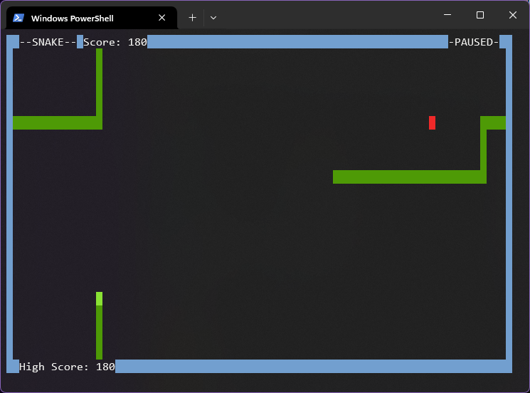
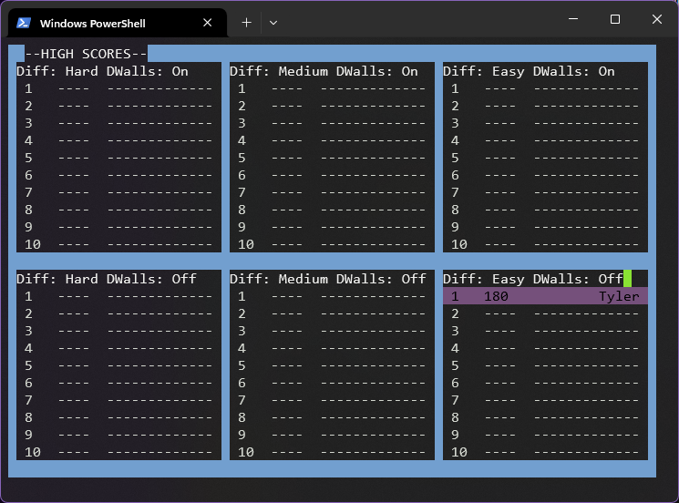

# Snake C++

I wanted to share this game that I made while first learning C++. Everything remains untouched from when I finished it years ago and includes functional menus, pause function, and color-customized high score entries.